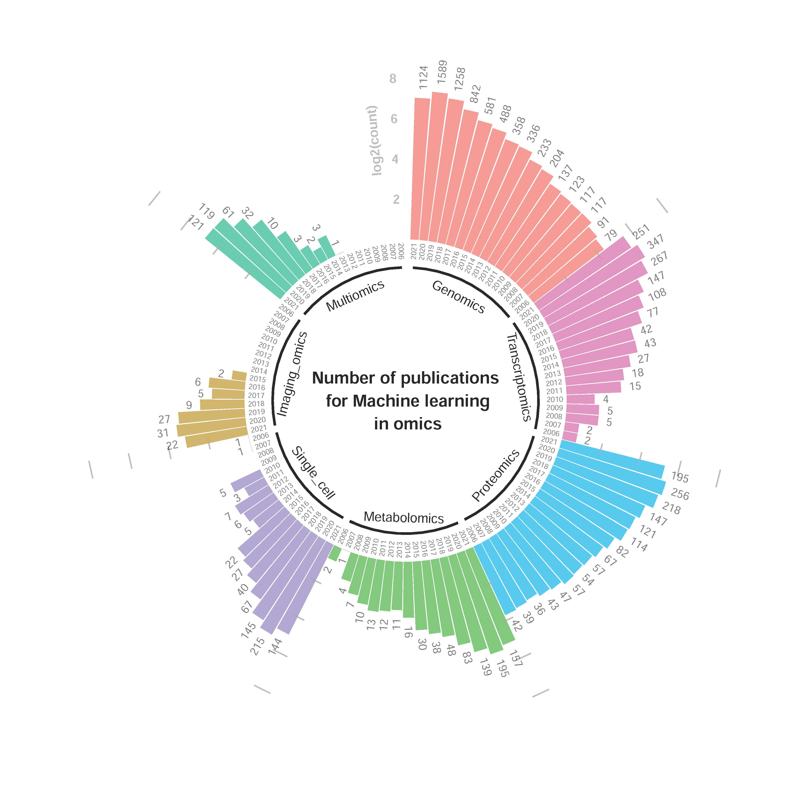

# The supplementary notes for "Machine learning meets Omics: applications and perspectives"
This repository provides the supplementary notes and figures for the review articale named "Machine learning meets Omics: applications and perspectives".

## Note 1: Common deep learning approaches and their architectures

## Note 2: Publication numbers for Machine Learning in Omics (2006-2021)

This repo has the source data and code for reproducing the circular barplot, which shows the increasing number of publication for machine learning (ML) in omics researches.

The plot is used in our comprehensive review paper titled: 'Machine Learning Meets the Omics: Applications and Perspectives'.

The folder contains 7 raw CSV files, which were downloaded from pubmed.ncbi.nlm.nih.gov as the date of August 7, 2021. The search URL is **https://pubmed.ncbi.nlm.nih.gov/?term=machine+learning%2C+[omics_type]&filter=years.2006-2021**, where the [omics_types] refers to 7 different -omics, which is given in the first row of each CSV file.

# Citation
Rufeng Li †; Yungang Xu †\*; Lixin Li \*; Juan Yang \*. Machine Learning Meets the Omics: Applications and Perspectives, 2021, under review. († equal contribution; \* correspendence)
