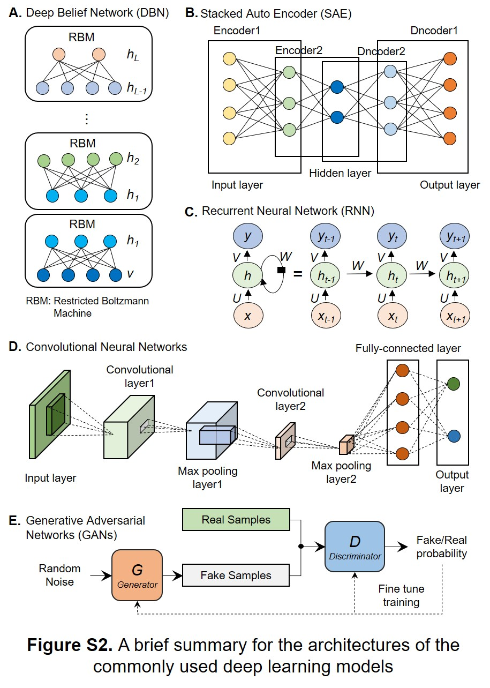

# The supplementary notes for "Machine learning meets Omics: applications and perspectives"
This repository provides the supplementary notes and figures for the review articale named "Machine learning meets Omics: applications and perspectives".

## Note 1: Common deep learning approaches and their architectures

### Deep Belief Network
Deep Belief Network (DBN) was one of the first non-convolution models to successfully apply deep architecture training, and started the current revival of deep learning since its first introduction in 2006. DBN is a generative model with several layers of latent variables, which is stacked by multiple Restricted Boltzmann Machines (RBM) (`Figure S1A`) as basic units. A single RBM consists of visible units and hidden units, which are connected in two directions, where the visible layers are multiplexed as input and output simultaneously. The DBN is trained using either the contrast spread or random maximum likelihood method. The first RBM is data driven, and the second RBM is trained to simulate the distribution defined by the hidden unit sampling of the first RBM. This process can be repeated indefinitely, adding any layer to the DBN, where each new RBM models a sample of the previous RBM, and each RBM defines another layer of the DBN. 
### Stacked Auto Encoder
An autoencoder is an unsupervised learning technique and a special type of neural network that is trained to copy its input to its output. Traditional autoencoders are used for the task of representation learning, such as dimension reduction and feature learning. In recent years, the connection between autoencoders and latent variable model theory has brought autoencoders to the forefront of generative modeling. A stacked autoencoder (SAE) is a neural network consists several layers of autoencoders where output of each hidden layer is connected to the input of the successive hidden layer (Figure S1B). Although the auto-encoder model is trained based on supervised learning algorithm, it is still an unsupervised learning process as a whole because the original data is not required to have classification labels during training. A stacked autoencoder is trained by an unsupervised layer-wise learning algorithm and then fine-tuned by a supervised method.
### Convolutional Neural Networks
Convolutional neural networks (CNN) are the most successful cases of biologically inspired artificial intelligence. Its key design comes from neuroscience, CNN is a key example of the successful application of the profound knowledge obtained from neural signals transmission in the brain to machine learning. CNN provides a way to specialize neural networks so that it can process neural networks with data similar to a grid structure, such as image data, which can be viewed as a two-dimensional pixel grid. CNN uses a special linear operation such as convolution to replace conventional matrix multiplication in at least one layer of the network. Its main ideas are area connection, multi-layer stacking, pooling and weight sharing. A typical CNN is composed of input layer, convolution layer, pooling layer, fully connected layer and output layer (Figure S1D). The convolution operation of the convolution layer is the core of the model.
### Recurrent Neural Network
Just as CNN is a neural network specially used to process grid data, Recurrent Neural Network (RNN) is a type of neural network used to process sequential data. CNN can be easily extended to images with large width and height, as well as to process images of variable size. Comparably, RNN can be extended to very long sequences, and most RNNs can handle variable-length sequences. There are connections between nodes in the hidden layers of RNN. In addition to the output of the input layer, the input of the hidden layer also contains the output of the previous hidden layer (Figure S1C). At present, the most effective sequence model in practical application is the gated RNN, which includes long short-term memory network based on gated circulatory units. The idea of gated RNN is based on generating a path through time in which the derivative neither disappears nor explodes. Leakage units achieve this by manually selecting constant connection weights or parameterized connection weights, which are generalized by gated RNN to connection weights that may change at each step. And gated RNN can learn to decide when to clear the state, rather than to decide manually.
### Generative Adversarial Networks
The Generative Adversarial Networks (GANs) was first proposed by Ian Goodfellow in 2014. The principle of GANs is to make two networks compete with each other (Figure S1E). One is the generator network, which constantly captures the data in the training library and generates new samples. The other is the discriminator network, which judges whether the data provided by the generator is true enough according to the relevant data. First, the discriminator is fixed and the generator is trained. With the continuous training, the effect of the generator is getting better and better. The discriminator cannot accurately judge whether the data provided by the generator is true or not. Then fix the generator and train the discriminator. Through continuous training, the discriminator's ability is improved, and the data provided by the generator can be judged accurately. At this time, the discriminator is fixed again. After continuous cycle, the effect of the generator and discriminator will be better and better. We can get a generator with very good performance, and we can use it to generate the data we want. GANs do not need to infer in the learning process and have no complex variational lower bound, which avoids the difficult problem of approximate calculation of probability. But there may be pattern missing in the learning process of GANs, and the generator will degenerate, always generate the same sample points, and cannot continue learning.

## Note 2: Publication numbers for Machine Learning in Omics (2006-2021)

This repo has the source data and code for reproducing the circular barplot, which shows the increasing number of publication for machine learning (ML) in omics researches.

The plot is used in our comprehensive review paper titled: 'Machine Learning Meets the Omics: Applications and Perspectives'.

The folder contains 7 raw CSV files, which were downloaded from pubmed.ncbi.nlm.nih.gov as the date of August 7, 2021. The search URL is **https://pubmed.ncbi.nlm.nih.gov/?term=machine+learning%2C+[omics_type]&filter=years.2006-2021**, where the [omics_types] refers to 7 different -omics, which is given in the first row of each CSV file.

The bar lengths refer to the log2-scaled publications numbers for each year, which is shown on top of the bars. The source data and codes for reproducing the plot are available in the folder named "Source_data_codes".

# Citation
Rufeng Li †; Yungang Xu †\*; Lixin Li \*; Juan Yang \*. Machine Learning Meets the Omics: Applications and Perspectives, 2021, under review. († equal contribution; \* correspendence)
